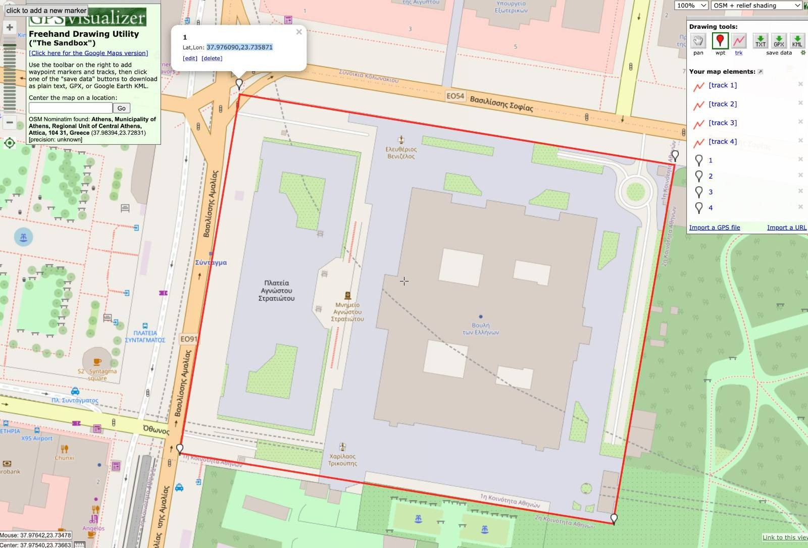

# 🏡 Land Registry 

## Problem
:::caution Land registeries are antiquated
Land ownership in many parts of the world are based on antiquated government systems. In some places, land records are even still stored on paper registries!
::: 

## Solution
:::success EAS
**EAS** can enable a global, standardized trust layer for governments and citizens that powers verifiable land ownership registries.
:::

## Example schema 
Using `EAS Schema #24`, governments can attest to the ownership of land. 

The schema has `3` properties:
```bash 
bytes polygonArea, uint8 landType, uint24 expiry 
```
- **bytes polygonArea** - A set of GPS coordinates that defines the verticies of the land (a closed polygon space)
- **uint8 landType** - Defines if the land is free-hold (0), lease-hold (1), or other (2)
- **uint24 expiry** - If the land is lease-hold, the expiry date of the land deed


## Example attestation
Here is an example attestation record: [0xc216a6f30c4767907769906e9cf73c71935032b2a7521c3b4407461724b69e22](https://easscan.com/attestation/view/0xc216a6f30c4767907769906e9cf73c71935032b2a7521c3b4407461724b69e22) attesting that an address `0x1234abd1238123781237babcdbf` owns some a land.


- `bytes polygonArea` 37.976090,23.735871 37.975832,23.737861 37.974523,23.737582 37.974775,23.735600  
(**4** GPS coordinates defining a rectangle)
- `landType`: 1 (1 is for lease-hold)
- `expiry`: 3245773289 (unix timestamp of the lease-hold expiry date)


If you plot this polygon on a map you’ll see the piece of land it encloses. And if you check the attestor address, you’ll see the Authority who attested to it.



## Example business ideas
1. **LandChain** - a decentralized land registry service that uses EAS to securely store and verify land ownership and transfer information. This helps to prevent fraud, streamline the land registration process, and provide secure access to land ownership records.
2. **SmartPlots** - a platform that uses EAS to verify and track the ownership, zoning, and development history of land parcels. This helps buyers, sellers, and regulators to make informed decisions about land transactions and development.
3. **Propr** - Propr is a smart contract platform that uses EAS to create and verify attestations of land ownership, property titles, and other legal documents. With Propr, users can easily and securely create, manage, and transfer ownership of land and property on the Ethereum blockchain. Propr also offers a range of tools and services to help users manage their property, including property appraisals, legal advice, and insurance. Propr is a simple and secure way to manage property on the blockchain.


## Future composability
:::info Thinking for the future
How can this evolve as EAS grows?
How can this be composed with other attestations?
:::

### Land ownership in the future
- Land and property can be bought and sold **ON-CHAIN**. 
- Property and land can be tokenized as NFT’s and ownership details `attested` to. 
- Governments can `attest` to the new owner of any land once the NFT is sold or transferrerd.  
- A smart contract that handles the sale of the property NFT would need to meet all the `attestation` requirements that a government demands in order to be valid.   
- Once the governemnt `attests` to the validity of the sale, Funds could be a released from the Buyer to Seller automatically, and a portion could be transfer taxes to the government. 

### Improving the mortgage process
`Attesations` can also help buyers and lenders to create a more competitive and trasnsparent mortgage market. Let’s think of a future example where **Bob** wants to buy some land, but needs a mortgage.

He can collect the following `attestations` from trusted providers which would be useful to help him buy the land title **ON-CHAIN**

```bash
1. Identity (Schema #111)
2. Credit score (Schema #222)
3. Personal Income (Schema #333)
4. Proof of Address  and other KYC (Schema #444)
5. Net worth (Schema #555)
6. Credit worthiness (Schema #666)
7. Appraisal value of the property he wants to buy (Schema #777)
```

Based on the attestations above, Lenders can decide whether or not they want to loan to Bob to buy a particular property. 
- If he meets their demands, (i.e. Credit score, income, Loan-to-Value, etc) They can deposit the USDC into the DAPP and atomically receive a lien on the property.   
- As soon as the government attests to the validity of the sale, the DAPP can atomically pay the seller and receive the NFT title from them.   
- The NFT can remain inside the DAPP custody contract until the mortgage is fully paid off, at which point it can be transferred to the sole owner.  
- Mortgage payments will be made inside the DAPP contract.  
- If the owner defaults on his mortgage payments, the Smart contract will realease the NFT title to the lender/bank, who can now take ownership of the property and sell it on some cool Mortgage DeFi platform trading site.

It’s the future.


