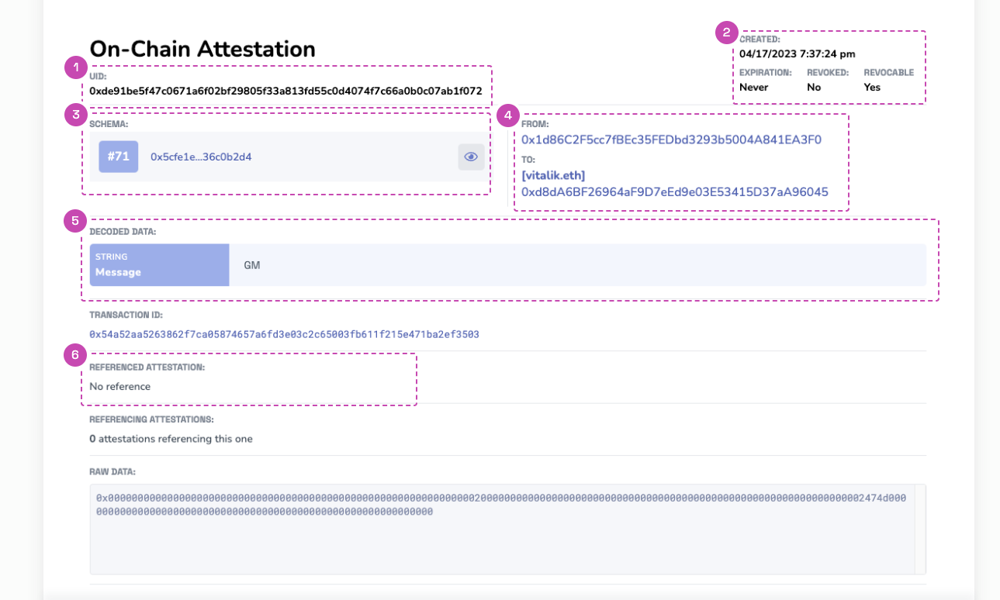

# Attestations

:::info What are attestations?
**Attestations** /ˌaˌteˈstāSH(ə)n; are digital records that serve as evidence or confirmation of information made by an entity about anything. 
:::

At its core, an attestation is a digital signature on structured data. Think of it as a digital stamp of approval or verification. It's a way for one entity (the attester) to make a claim about another entity or about some data. This claim is then cryptographically signed to ensure its authenticity and immutability. With EAS, attestations can be made onchain or offchain.

## Why Attestations Matter
Attestations are crucial because they offer a means of establishing trust and credibility online. In the
absence of face-to-face interaction or physical presence, it can be challenging to determine the accuracy or reliability
of information. Attestations provide third-party validation and a cryptographically signed confirmation of the
authenticity of a piece of information, making it easier for others to trust and depend on that information.

The **credibility** of an attestation hinges on the reputation of the entity making it. For instance, a credit score attestation holds weight when issued by a recognized credit bureau, but not so much if declared by an individual.

📘 **Read more:** [**Why We Built EAS**](/docs/purpose/eas-purpose.md)

## When to use Attestations
Attestations serve as a bridge between the digital and physical worlds, providing a mechanism to verify and validate claims in various scenarios. Here's a more comprehensive look at when attestations can be invaluable:

- **Verifying:** Confirming the authenticity of a product or the accuracy of information.
- **Vouching:** Endorsing someone's skills, experience, or character.
- **Voting:** Recording preferences or decisions in elections or community polls.
- **Proving:** Demonstrating ownership of assets, completion of tasks, or attainment of milestones.
- **Authenticating:** Establishing the genuineness of an item, artwork, or collectible.
- **Certifying:** Validating completion of courses, training, or adherence to standards.
- **Endorsing:** Publicly supporting or recommending a product, service, or individual.
- **Validating:** Confirming the legitimacy of a claim, be it health records, financial status, or any other data.
- **Recording:** Keeping a digital note of events, achievements, or incidents.
- **Witnessing:** Attesting to the occurrence of an event, action, or decision.
- **Guaranteeing:** Assuring the quality, durability, or performance of a product or service.
- **Declaring:** Making a formal or official statement about a fact, intention, or belief.
- **Confirming:** Corroborating an event, transaction, or activity.
- **Securing:** Ensuring the safety, privacy, or confidentiality of data or actions.
- **Identifying:** Establishing the identity or characteristics of an individual, organization, or item.

## Attestation Example
Below is an example onchain attestation record. It's from one address (0x1d86...1EA3F0) attesting a message to vitalik.eth saying "GM".

1. **Every attestation is unique:** Each attestation has its own unique identifier (UID) which is a hash of the entire attestation
2. **Know the current status of the attestation:** Verify the current status of the attestation to see when it was created, if it has expired, or if the attester has revoked it. This can help you determine if the attestation is still valid and trustworthy, ensuring you have the most up-to-date information.
3. **Every attestation follows a schema:** Schemas are the data of the attestation. They are completely customizable and can be created for any purpose, allowing users to leverage preexisting schemas or create new ones tailored to their specific needs.
4. **Know who is involved**: Find out which address made the attestation and if there is a recipient involved. Knowing who is involved in the attestation is important to understand the context and trustworthiness of the information being attested to.
5. **Get a clear view of the attestation data:** The attestation data will be decoded in this section based on the schema used so that it is easily legible for any verifiers or users inspecting the attestation content.
6. **Build composable attestations:** One of the most powerful features of EAS is its ability to allow attestations to reference other attestation UIDs. This makes it possible to organize attestations in a more structured manner and understand their relationships easily.

## How Attestations are Made
Creating an attestation is a straightforward process, but it's underpinned by robust cryptographic principles:

1. **Define the Data:** Before making an attestation, you need to know what you're attesting to. This is where the schema comes into play. Either select a pre-existing schema or create a new one that defines the structure of your data.

2. **Sign the Data:** The issuer (or attester) then signs this structured data using their private key. This signature is a cryptographic seal of approval, ensuring the data hasn't been tampered with.

3. **Store the Attestation:** Once signed, the attestation is stored. With EAS, this can be on the blockchain (onchain) or off the blockchain (offchain).

4. **Verification:** Post creation, anyone can verify the attestation if made available to them. They can check the digital signature against the issuer's public key, ensuring the attestation's authenticity.

5. **Lifecycle Management:** Over time, the status of an attestation might change. While it can't be edited due to its immutability, it can be revoked if the information is no longer valid. This revocation is also stored, ensuring a clear history of the attestation's lifecycle.

6. **Referencing & Building:** One of EAS's powerful features is the ability to reference other attestations. This allows for the creation of a web of interconnected attestations, each adding context and depth to the others.

## Tools to Start Building
To dive deeper into the world of attestations and begin crafting your own, explore the EAS platform. We offer a range of tools and resources, from a no-code schema builder to SDKs, that make the process intuitive and efficient. Join the EAS community and be a part of the movement in digital trust and verification.

- [**SDK**](/docs/developer-tools.md/eas-sdk.md)
- [**GraphQL API**](/docs/developer-tools.md/api.md)
- [**Tutorials**](/docs/category/tutorials)

