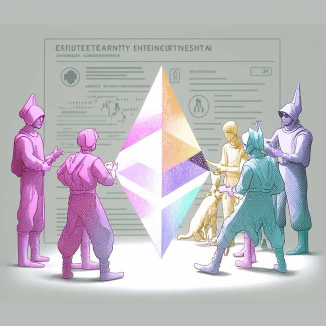

# How Attestations Work
EAS enables anyone to create, verify, and revoke attestations onchain or off-chain using two simple solidity contracts.

An attestation is a statement made by an Attestor (individual or entity), who attests to the authenticity of certain information. The Attestor creates an attestation using a predefined schema, which defines the data structure of the attestation. Once the attestation data has been provided, then the Attestor makes the attestation by signing the attestation with their keys. 

## How They Are Made
Attestations can be made using the SDK, using the contracts, or on the EASScan UI. To create an attestation, you will need to have an Ethereum wallet and some Ether to pay for the transaction fees on the Ethereum network if the attestation is onchain (or the chain of your choice). You will also need to know the UID of the schema you want to use to create the attestation or create your own schema.

To create an attestation, an Attestor must first select a schema that defines the structure and rules for the attestation. The Attestor must then provide the required information and data for the attestation, using the format and structure defined by the schema following the Ethereum ABI types. You can create the attestation on/off-chain depending on your project goals and use case. 

Try making a sample attestation on Optimism. [https://optimism.easscan.org/learn](https://optimism.easscan.org/learn)

## Example
- **Create or use a schema:** First, the user creates a schema for the type of attestation they want to make. For example, let's say the user wants to make a statement about something they believe in. The schema might include fields for the statement, the user's name, and the date.

- **Make an attestation:** Next, the user fills out the fields in the schema with the information they want to attest to. For example, the user might fill out the statement field with "I believe in the power of positive thinking" and the name field with their own name.

- **Sign the attestation:** Finally, the user signs the attestation with their Ethereum wallet to prove that they are the one making the attestation. The wallet will automatically add the user's Ethereum address and a timestamp to the attestation as well.

- **Verify the attestation:** Others can then use the EAS API to verify the authenticity of the attestation by checking the signature and ensuring that it matches the user's Ethereum address. They can also view the schema and the attestation data to see the information that the user has attested to.

- **Revoking the attestation:** If the original Attester no longer believes in positive thinking, then they can revoke their attestation using EAS. This does NOT delete the attestation record but creates a status of the attestation as being revoked. This keeps the original authenticity of the attestation and opens up additional use cases like time-based credentials, permissioned based access for subscriptions / events / communities, current status of roles in an organization/DAO, and more.
