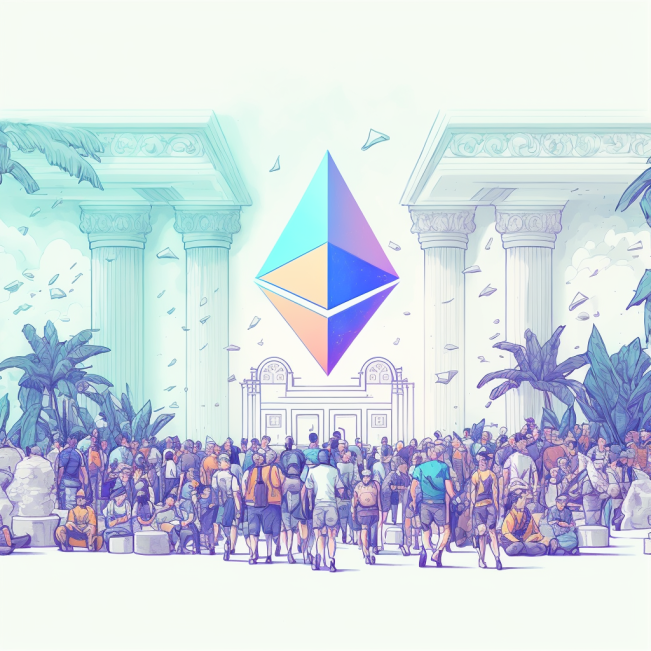

# Impact Over Profit
Public goods are foundational in driving innovation, collaboration, and trust within ecosystems like Ethereum. EAS, with its decentralized, open-source, and tokenless design for attestations, embodies this principle, offering a universally beneficial service.

## EAS is a Public Good
EAS stands out due to its commitment to being a public good. Its open-source, permissionless, and tokenless nature ensures that it remains neutral, fostering trust and integrity in the attestation ecosystem.

For a foundational layer addressing the very nuanced and personal facets of trust online, financial motivations or centralized control are counterproductive. While for-profit solutions excel in niche areas, they can't serve as primitive infrastructure due to inherent biases. Public goods focus on value creation over value extraction. 

EAS, as a public good, offers the base layer that's credibly neutral. While numerous businesses can thrive atop EAS, its primary role is to catalyze innovation, ensuring equitable opportunities for all.

## Understanding Public Goods
Public goods are universally accessible resources. They're available to all, and one's usage doesn't diminish their availability for others. Imagine a public park: open for all, irrespective of individual contributions to its upkeep.

Within Ethereum and the broader blockchain ecosystem, public goods span open-source codes, educational platforms, community gatherings, and projects emphasizing ecosystem enhancement over mere profit.

:::info Know the difference
Teams may claim to be a public good, but they are often for-profit and value extractive for their own gain.
::::

### Why Public Goods Matter
- **Trust Building:** Public goods are pillars of trust. For example, open-source codes champion transparency and collective refinement.
- **Foster Innovation:** Unrestricted access to tools and knowledge empowers developers and entities to evolve existing projects and create completely novel solutions.
- **Boost Collaboration:** Common platforms and resources amplify collaboration, offering a unified platform for collective success.
- **Impact over Profit:** Prioritizing impact over profit, public goods ensure unbiased, genuine contributions to and from the community.

### How Public Goods Grow
Building public goods demands dedication and time. Teams with a vision for impact often face the dilemma of securing funds without compromising their mission. However, our ecosystem is adept at starting and motivating impact-focused teams. Here are a few ways public goods, like EAS, grow:

#### Community Contributions
Public goods are built by small teams that often grow into large communities with a shared purpose to make the broader ecosystem, simply, better. Because of their often open-source and impact focused nature, many public goods benefit from the network effects and collective intelligence of the community looking to further its purpose.

Any small contribution whether it's calling out something to update on a docs page, writing an article or tweet educating about the public good, or directly contributing to the code base are all great ways to "contribute".

#### Grants & Donations
Many teams start public goods by bootstrapping funds and their time or by receiving donations, while noble, these funding sources are often not sustainable long-term. One step up are grants tailored for public goods. Grant programs are plentiful in the Ethereum Ecosystem with projects like:
- Funding Platforms ([Gitcoin](https://grants.gitcoin.co/), [Giveth](https://giveth.io/), [The Giving Block](https://thegivingblock.com/), [Endaoment](https://endaoment.org/) et.al)
- Ecosystem Grants ([Ethereum Foundation](https://ethereum.org/en/foundation/), [OP](https://community.optimism.io/docs/governance/get-a-grant/), [Arbitrum](https://arbitrum.foundation/grants?address=0xeee68aECeB4A9e9f328a46c39F50d83fA0239cDF), et.al).

#### Retroactive Funding
Ecosystems like Optimism have been championing [Retroactive Public Goods Funding](https://app.optimism.io/retropgf). The core idea behind retroactive funding is that it's easier to determine the impact of an innovation after it's made its impact. Thus, many teams like Optimism will fund Public Goods for the impact they make on their own ecosystem. As the impact is made, their ecosystem hits new growth goals or revenue targets and then allocates that benefit back to the team or innovation that helped them get there. Then these teams continue building into a virtuous cycle of innovation and growth.

#### Revenue Sharing
New models, like the [Public Goods Network (PGN)](https://publicgoods.network/), let public goods share in the revenue they help generate. If a public good boosts transaction volume on the network, it gets a piece of the fees generated.

## Conclusion
Public goods, like EAS, are the backbone of thriving ecosystems. They ensure that the foundation remains neutral, transparent, and accessible to all, fostering an environment where innovation and collaboration can flourish. Prioritizing the collective good over individual profit, public goods set the stage for a more inclusive and equitable future.

## Get Involved
EAS thrives on community involvement. Whether you're a developer, writer, or just an enthusiast, there's a place for you:

- **Contribute to the Codebase:** Dive into our [GitHub repository](https://github.com/ethereum-attestation-service) and help improve EAS.
- **Share Knowledge:** Write articles, create tutorials, or host webinars to spread the word about EAS.
- **Donate or Fund:** Support the project directly or guide us towards potential grants.
- **Join the Conversation:** Engage with us on [Builder's Telegram](https://t.me/+EcynOr0iFu03MTYx) or [Twitter](https://x.com/eas_eth) and be part of the EAS journey.

Remember, every contribution, no matter how small, pushes the mission forward. Let's build a more trustworthy and collaborative Ethereum ecosystem together!