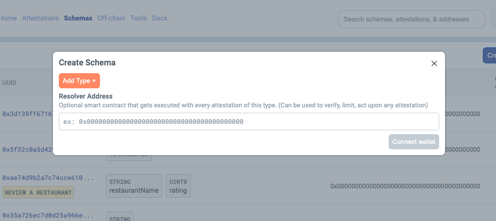
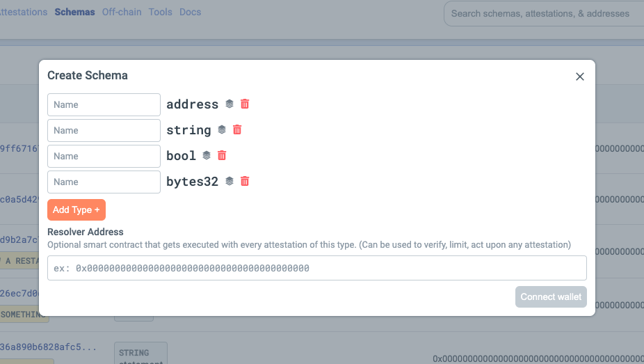

# Make an Attestation
Making an attestation allows anyone to attest with any [Attestation Schema](https://easscan.com/schemas) registered with EAS. You can make attestations using the API or the UI builder on the [EASScan website](https://easscan.com/attestation/create).

:::tip You must have a wallet connected to use the Make Attestation UI 
:::

## The Attestation Contract 📄

`Attest` with `Schemas` using the `EAS.SOL` contract. [View the entire contract on github](https://github.com/ethereum-attestation-service/eas-contracts/blob/master/contracts/SchemaRegistry.sol).

Here's an overview of the contract: 
1. The contract is initialized with the addresses of a global schema registry and an EIP-712 verifier.
2. Users can use the contract's `attest()` function to create an attestation. This function takes several arguments, including the optional recipient of the attestation, the schema of the attestation data, the optional expiration time of the attestation, and the data to be attested to. The function also takes a `refUUID` argument, which allows the attestation to reference another attestation.
3. Users can also use the contract's `attestByDelegation()` function, which is similar to `attest()` but allows the user to delegate the attestation process to another address. This function takes additional arguments for the delegated attester's address and a signed message.
4. Once created, an attestation can be retrieved by its unique identifier (UUID) using the contract's `getAttestation()` function.
5. Attestations can be revoked using the contract's `revoke()` and `revokeByDelegation()` functions. These functions work similarly to the `attest()` and `attestByDelegation()` functions, respectively.
6. The contract also provides several error-checking functions, such as `isValidAttestation()` and `isRevoked()`, which can be used to verify the validity and revocation status of an attestation.
7. The contract also allows users to check the addresses of the global schema registry and the EIP-712 verifier using the `getSchemaRegistry()` and `getEIP712Verifier()` functions.

```jsx title="/contracts/SchemaRegistry.sol"

    function register(string calldata schema, ISchemaResolver resolver) external returns (bytes32) {
        SchemaRecord memory schemaRecord = SchemaRecord({ uuid: EMPTY_UUID, schema: schema, resolver: resolver });

        bytes32 uuid = _getUUID(schemaRecord);
        if (_registry[uuid].uuid != EMPTY_UUID) {
            revert AlreadyExists();
        }

        schemaRecord.uuid = uuid;
        _registry[uuid] = schemaRecord;

        emit Registered(uuid, msg.sender);

        return uuid;
    }
```

A new page is now available at [http://localhost:3000/my-react-page](http://localhost:3000/my-react-page).

## Create a Schema on the EAS Website 🧙

Go to => [https://easscan.com/schemas](https://easscan.com/schemas): 

:::tip Tip
Make sure you've connected your wallet to EAS.
:::

### `#1` Click on the `Create Schema` button 
Navigate to the Schema's page and click on `Create Schema`. This will trigger the modal wizard to start the process. 


### `#2` Add your Schema field types. 
Click on the `Add Type` button which will allow you to add your Schema fields. You can add as many fields as you need for your Schema use case.




### `#3` Name your Schema fields. 
It's best practice to use camelCase when labeling your Schema. 




### `#4` Click `Create Schema` and sign the transaction. 
Once you click `Create Schema` it will trigger an Ethereum transaction with your connected wallet. 
- Review the signature and sign.
- Once you sign, the transaction will start processing.


### `#5` Find your Schema in the Registry. 
The Schema will be automatically assigned an Schema ID#. Once it generates, feel free to click it and inspect the Schema Details.


### `#6` Open your schema. 
The Schema will be automatically assigned an Schema ID#. Once it generates, feel free to click it and inspect the Schema Details.


