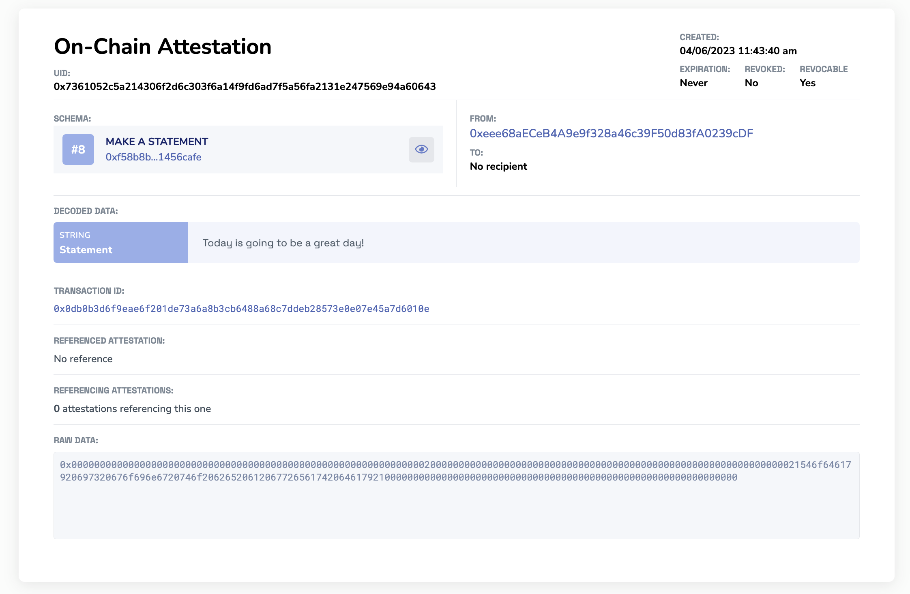
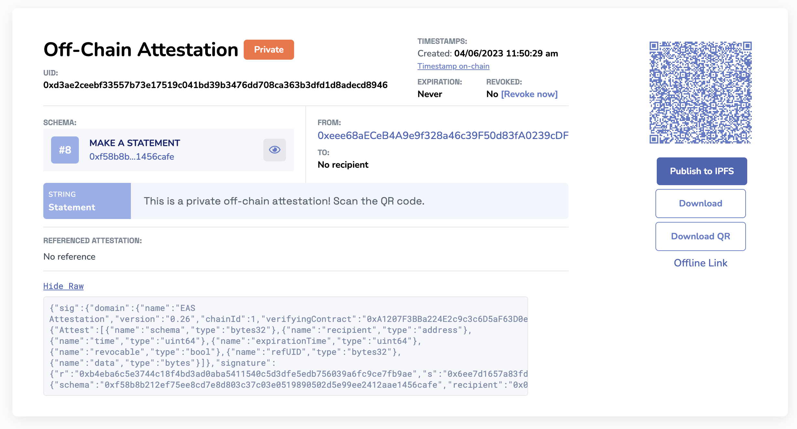

# Make an Attestation

Anyone can attest with any [Attestation Schema](https://easscan.org/schemas) registered with EAS. An attestation can be
made in a few ways.

- [EASScan website](https://easscan.org/attestation/create) - This is the easiest way to make an attestation.
- Using the [EAS SDK](https://github.com/ethereum-attestation-service/eas-sdk) - This is the recommended way to make an
  attestation when you are building a dApp, especially when you want to make off-chain attestations.
- Interacting with the EAS contract directly - This is the most flexible way to make an attestation especially if you
  need to make attestations from a smart contract.
- Go to => [https://easscan.org/schemas](https://easscan.org/schemas) to explore available schemas or make your own.

# The Attestation Record

A unique `attestation record` is created each time an attestation is made using EAS and can be verified on
the [EAS explorer](https://easscan.com). The attestation record contains important information about the attestation,
including the schema used, the attestor, the recipient (if specified), the expiration time (if specified), and more.

In this guide, we'll walk through how to read and understand an attestation record and transaction, including the
various fields and data included in an attestation.

## Understanding the Attestation Record

Each attestation record has the following fields:

- `UID` - this is a universal unique identification number for the attestation.
- `Schema` - the UID of the schema used to make the attestation.
- `Attestor` - the address that made the attestation.
- `Recipient` - an **optional** recipient of the attestation that was made.
- `Expiration Time` - an **optional** date that the attestation will expire if provided by the attestor.
- `Revocation Time` - the time at which the attestation was revoked (if any).
- `refUID` - An attestation that this attestation is referencing (if any).
- `data`- The ABI encoded data for the attestation.

### **Example On-Chain Attestation Record** 
This is an example on-chain attestation record for "Making a Statement". The header contains information such as the UID, who made the attestation (attestor), recipient (if provided), the revocation status, and if the attestation is set to expire.

### **Example Private Off-Chain Attestation Record** 
This is an example off-chain attestation record for "Making a Statement". The difference between the on-chain record and this off-chain attestation is that this attestation is public. The server doesn't even know about it. You can easily share this attestation URL with others who can then decode the attestation data, publish it to IPFS, and more. If this attestation were to be published or pinned to IPFS, the status icon will change to "public".

You can access this example private off-chain attestation by going to this:
- [Example Private Off-Chain Attestation.](https://easscan.org/offchain/url/#attestation=eNqlkjmOHDEMAP%2FSccPgIV7hzM7OJwwHOqgHGDbg55vdcOB8FQiQVCyKlL4f8I30OPE84M8DCezNz2cnap80Y%2FLUl%2FS38gtyoDh9pLgdFzxajq5Tkq21ib7bWNwX9NGlIUqDKYvXTsk1TBQ4uu5ypu0RPW%2BJZtpCFevOezWMPjWURMxpOM4WkoFpHlvSIn3LIN3IXWAtgOMkuzyZqd4%2FP%2FLZHpGxmbw3nRzv4kr9AOKYr%2FedtK6ZNDPHZq5MwzjRBGNCw6ohBjfTtQx8dlYeVcTC5X3lXB5Nb8kWHz4IKbdJps9l6cuBJ9sETiihBwjQqhIikxpS74lNdPZ9l19tVwcHA4oT7o1fP3%2FnpYcvDfpaOFR7m7qGMcG%2F%2BfoaYFQrVbSmUntba9BSLhbr3fLirF2nVr%2Fi5qKorDaBVCuLKsYud8ULClUEF3H58v8bHCf8%2BAtyp6Fo)

# EAS SDK
The EAS SDK is a Javascript/Typescript library that simplifies the process of creating and managing attestations using EAS. The SDK provides a set of easy-to-use functions to interact with the EAS smart contracts and perform various operations, such as creating, viewing, and revoking attestations, as well as timestamping data.

To start using the EAS SDK, follow the [Javascript Integration](/docs/getting--started/javascript) guide, which covers installing the SDK, initializing the library, and connecting it to an Ethereum provider. The guide also includes examples of how to use the SDK to perform various tasks related to attestations, such as:

- Creating on-chain attestations
- Creating off-chain attestations
- Viewing on-chain attestations
- Revoking on-chain and off-chain attestations
- Creating timestamps for data

The EAS SDK will enable devs to easily integrate EAS into their projects and harness the power of attestations to create more trust and transparency in their digital interactions. Whether you're building a decentralized application (dApp) on the Ethereum blockchain or a Web2 service that can benefit from the added trust and authenticity provided by attestations, EAS offers a powerful and flexible solution for your needs.
