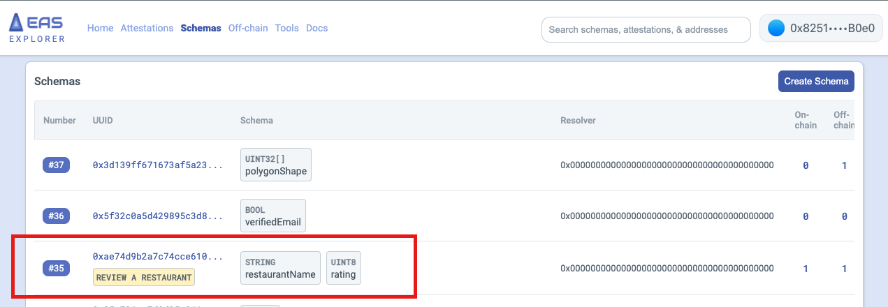
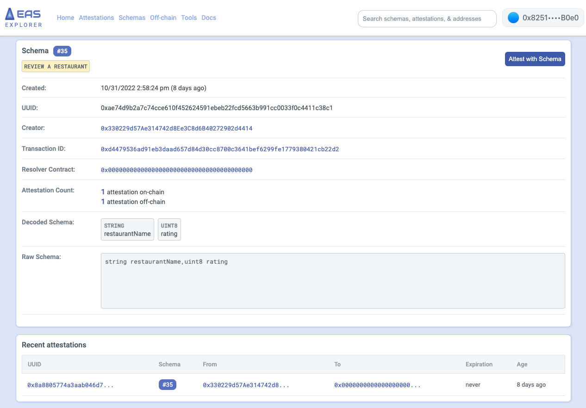

# Create a Schema
A schema is a way of organizing data. Schemas are the building blocks to all attestations. They establish the rules and conditions you want to attest with. You can create schemas about anything, and they are completely customizable. This means that you can choose preexisting schemas that meet your needs or compose new ones with more fields or different naming conventions. 

:::tip Tip
Double check the [Schemas](https://easscan.com/schemas) on the EAS Explorer to see if there is already a Schema for your attestation need.
:::

## Schema Fields ✔️
Schemas follow the **Solidity ABI** for acceptable types. Below is a list of current elementary types: 

- `address` An address can be any ethereum address or contract address. Equivalent to unit160, except for the assumed interpretation and language typing.
- `string` A string can be any text of arbitrary length
- `bool` A bool can either be on or off. Equivalent to uint8 resitricted to the values of 0 and 1.
- `bytes32` A bytes32 is a 32 byte value. Useful for unique identifiers or small data.
- `bytes` A bytes value is an arbitrary byte value.
- `<type>[]`  A variable-length array of elements of the given type.
- `uints` uint values can be from uint8 -> uint256.

Have questions about acceptable types? Learn more about [Solidity ABI types](https://docs.soliditylang.org/en/v0.8.16/abi-spec.html).

## 1. Learn about the The Schema Contract 📄

`Schemas` are registered using the `SchemaRegistry.SOL` contract. [View the entire contract on github](https://github.com/ethereum-attestation-service/eas-contracts/blob/master/contracts/SchemaRegistry.sol).

This contract allows users to register a schema that defines the data format for a specific type of attestation, along with a schema resolver contract that can be used to verify the data. Here is a step-by-step explanation of what the contract does:

1. The contract is initialized with the `ISchemaRegistry` and `ISchemaResolver` interfaces.
2. Users can use the contract's `register()` function to register a schema. This function takes two arguments: the schema itself, which is a string representing the JSON object, and the address of the schema resolver contract.
3. The `register()` function calculates a unique identifier (UUID) for the schema using the `_getUUID()` private function, which hashes the schema and schema resolver address.
4. The function then checks if a schema with the same UUID has already been registered by checking the `_registry mapping`. If a schema with the same UUID exists, the function will revert with the `AlreadyExists()` error.
5. If the schema is unique, the function will add it to the `_registry` mapping and emit a `Registered()` event.
6. Users can retrieve a registered schema by its UUID using the contract's `getSchema()` function. This function returns the schema record, which contains the schema and schema resolver address.

## Create a Schema on the EAS Website 🧙

Go to => [https://easscan.com/schemas](https://easscan.com/schemas): 

:::tip Tip
Make sure you've connected your wallet to EAS.
:::

### `#1` Click on the `Create Schema` button 
Navigate to the Schema's page and click on `Create Schema`. This will trigger the modal wizard to start the process. 

### `#2` Add your Schema field types. 
Click on the `Add Type` button which will allow you to add your Schema fields. You can add as many fields as you need for your Schema use case.

### `#3` Name your Schema fields. 
It's best practice to use camelCase when labeling your Schema. 

### `#4` Click `Create Schema` and sign the transaction. 
Once you click `Create Schema` it will trigger an Ethereum transaction with your connected wallet. 
- Review the signature and sign.
- Once you sign, the transaction will start processing.

### `#5` Find your Schema in the Registry. 
The Schema will be automatically assigned an Schema ID#. Once it generates, feel free to click it and inspect the Schema Details.

### `#6` Open your schema. 
The Schema will be automatically assigned an Schema ID#. Once it generates, feel free to click it and inspect the Schema Details.

