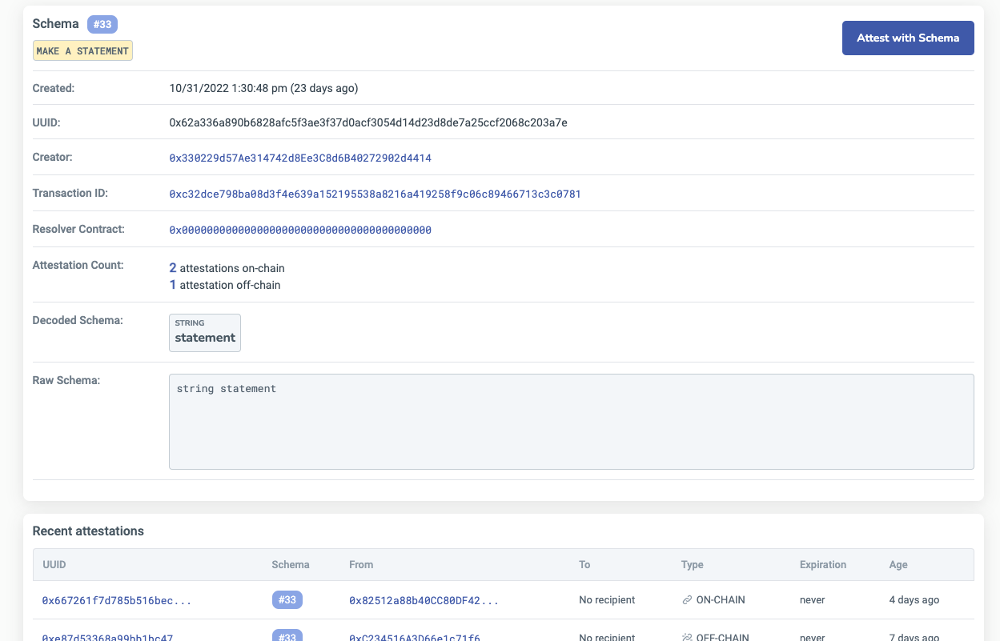

# The Schema Record
EAS uses smart contracts written in Solidity to register and verify attestations. Each schema registered on EAS has a record that can be viewed on EASScan [https://easscan.com/schemas](https://easscan.com/schemas). 

## Understanding the EAS schema record
Learn how to read a schema record and understand if it's the proper structure for your use case.

Each schema record has the following fields:
- `Schema #` - this is an incremental number automatically assigned to the Schema. It is not a unique identifier.
- `Schema Label` - these are **optional** labels that can be referenced to a Schema using the [name a schema](https://easscan.com/schema/view/0xb470821c6361c846977354c26b1386b60f48876c252544b8fdba8fe1888a2c10) schema.
- `Created Date` - timestamp of when the schema was created.
- `UUID` - this is the unique universal identifier assigned to the schema.
- `Creator` - the wallet address that created the schema.
- `Transaction ID` - The unique transaction ID on Etherscan that registered the schema on Ethereum.
- `Resolver Contract` - An optional contract assigned to the Schema for more complex use cases.
- `Attestation Count` - The number of attestations both on/off-chain that have been made using this schema.
- `Decoded Schema`- The decoded version of the schema field types.
- `Raw Schema` - The encoded schema version of the schema field types.

**Example Schema Record**


## The SchemaRegistry contract
Schemas are made using the `SchemaRegistry.sol` contract. [You can see the current version of the contract on github](https://github.com/ethereum-attestation-service/eas-contracts/blob/master/contracts/SchemaRegistry.sol)

```bash jsx
// SPDX-License-Identifier: MIT

pragma solidity 0.8.17;

import { EMPTY_UUID } from "./Types.sol";
import { ISchemaRegistry, SchemaRecord } from "./ISchemaRegistry.sol";

import { ISchemaResolver } from "./resolver/ISchemaResolver.sol";

/**
 * @title The global schema registry.
 */
contract SchemaRegistry is ISchemaRegistry {
    error AlreadyExists();

    // The version of the contract.
    string public constant VERSION = "0.15";

    // The global mapping between schema records and their IDs.
    mapping(bytes32 => SchemaRecord) private _registry;

    /**
     * @inheritdoc ISchemaRegistry
     */
    function register(string calldata schema, ISchemaResolver resolver) external returns (bytes32) {
        SchemaRecord memory schemaRecord = SchemaRecord({ uuid: EMPTY_UUID, schema: schema, resolver: resolver });

        bytes32 uuid = _getUUID(schemaRecord);
        if (_registry[uuid].uuid != EMPTY_UUID) {
            revert AlreadyExists();
        }

        schemaRecord.uuid = uuid;
        _registry[uuid] = schemaRecord;

        emit Registered(uuid, msg.sender);

        return uuid;
    }

    /**
     * @inheritdoc ISchemaRegistry
     */
    function getSchema(bytes32 uuid) external view returns (SchemaRecord memory) {
        return _registry[uuid];
    }

    /**
     * @dev Calculates a UUID for a given schema.
     *
     * @param schemaRecord The input schema.
     *
     * @return schema UUID.
     */
    function _getUUID(SchemaRecord memory schemaRecord) private pure returns (bytes32) {
        return keccak256(abi.encodePacked(schemaRecord.schema, schemaRecord.resolver));
    }
}

```
