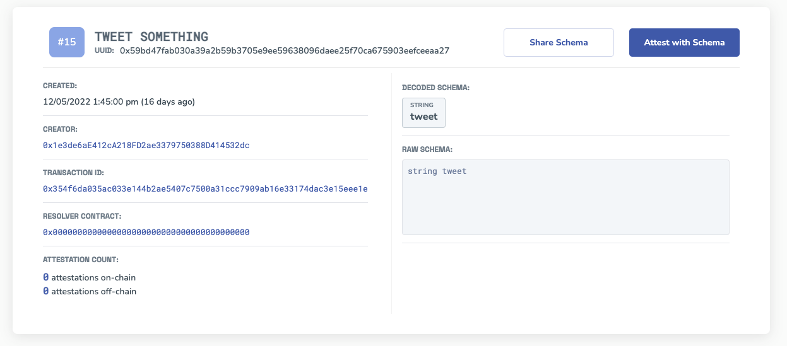

# The Schema Record
EAS uses Ethereum smart contracts to register and verify attestations. Each schema registered on EAS has a record that can be viewed on EASScan [https://easscan.com/schemas](https://easscan.com/schemas). 

## Understanding the EAS schema record
Learn how to read a schema record and understand if it's the proper structure for your use case.

Each schema record has the following fields:
- `Schema #` - this is an incremental number automatically assigned to the Schema. It is not a unique identifier.
- `UUID` - this is the unique universal identifier assigned to the schema.
- `Creator` - the wallet address that created the schema.
- `Transaction ID` - the Ethereum transaction registering the schema on EAS.
- `Resolver Contract` - An optional contract assigned to the Schema for more complex use cases.
- `Attestation Count` - The amount of attestations that have been made with attestations on/off chain.
- `Schema` - The ABI encoded schema field types.

**Example Schema Record**

## The SchemaRegistry contract
Schemas are made using the `SchemaRegistry.sol` contract. [You can see the current version of the contract on github](https://github.com/ethereum-attestation-service/eas-contracts/blob/master/contracts/SchemaRegistry.sol)
